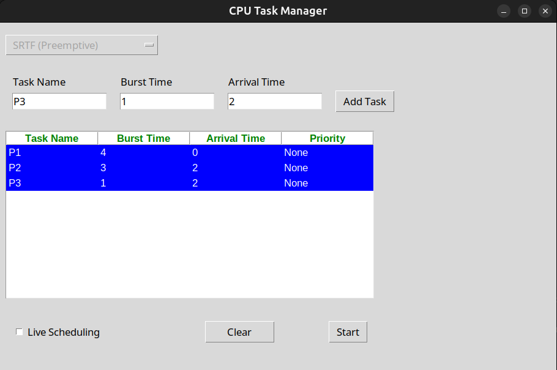
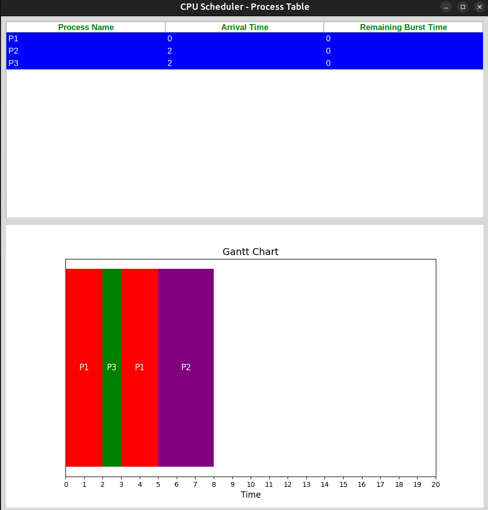

# CPU Scheduler Simulator

A **GUI-based desktop application** that visually simulates various CPU scheduling algorithms in real-time.

<p align="center">
  
</p>

---

## 🚀 Features

* **Multiple Scheduling Algorithms**
  Supports four major CPU scheduling techniques:

  * First-Come, First-Served (FCFS)
  * Shortest Job First (SJF)
  * Priority Scheduling
  * Round Robin (including preemptive variants)

* **Interactive Visualization**
  Watch a live Gantt chart update as processes are scheduled.

  <p align="center">
    
  </p>

* **Flexible Execution Modes**
  Choose between batch simulation or live process insertion to see how the scheduler reacts dynamically.

* **Educational Utility**
  Perfect for operating systems coursework, algorithm analysis, or demonstration environments—helping users understand scheduling behavior visually and interactively.

---

## 📦 Installation

1. Clone the repository:

   ```bash
   git clone https://github.com/AhmedSaid3617/CPU-scheduler.git
   cd CPU-scheduler
   ```

2. Install dependencies:

   ```bash
   pip install -r requirements.txt
   ```

3. Run the GUI application:

   ```bash
   python Run_Gui.py
   ```

---

## 🎮 Usage

* Select the scheduling algorithm (FCFS / SJF / Priority / Round Robin).
* Choose execution mode: **batch vs live insertion**.
* Watch scheduling unfold in real-time with Gantt chart animations and relevant metrics (e.g., waiting time, turnaround time).

---

## 🧮 Supported Algorithms

| Algorithm       | Description                                                                            |
| --------------- | -------------------------------------------------------------------------------------- |
| **FCFS**        | Services processes in the order they arrive—simple and non-preemptive.                 |
| **SJF**         | Executes the shortest job next; may include preemptive behavior for new shorter tasks. |
| **Priority**    | Chooses processes based on priority levels; can be preemptive or non-preemptive.       |
| **Round Robin** | Fair, time-sliced scheduling; supports dynamic insertion and preemption.               |

---

## 📂 Project Structure

```
├── core/          # Core scheduling logic and engine
├── Gui/           # GUI components and Gantt chart implementation
├── docs/
│   └── screenshots/ # Images used in README and docs
├── test/          # Unit and integration tests
├── Run_Gui.py     # Application launch script
├── setup.py       # Packaging and installer settings
└── README.md      # Project overview (this file)
```

---
