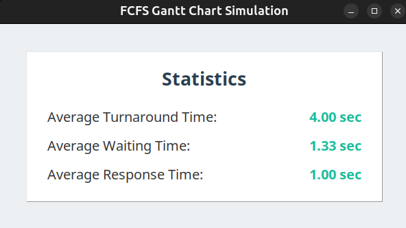

# GUI

---

## **Features Overview**

1. **Live Simulation Mode**  
   - Allows users to input tasks dynamically while the simulation is running.  
   - Each time step corresponds to 1 second in real time.  
   - The Gantt chart is updated continuously to reflect the current state of the scheduler.  
   - *Refer to the image below for an example of the live simulation interface.*

2. **Non-Live Simulation Mode**  
   - Users input all tasks before starting the simulation.  
   - The Gantt chart is displayed immediately after the simulation begins, showing the entire schedule.  
   - *Refer to the image below for an example of the non-live simulation interface.*

---

## **How to Use the GUI**

### **Input Tasks**
- **Purpose**: Enter the tasks to be scheduled.
- **Fields**:
  - **Task Name**: A unique identifier for the task.
  - **Arrival Time**: The time at which the task arrives in the system.
  - **Burst Time**: The time required for the task to complete.
  - **Priority** (optional): Used for priority-based scheduling algorithms.
- **Buttons**:
  - **Add Task**: Adds the task to the list of tasks.
  - **Start Simulation**: Begins the simulation in either live or non-live mode, depending on the selected option.
- **Live Mode**: Tasks can be added dynamically after the simulation starts.

   

---

### **Gantt Chart**
- **Purpose**: Visualize the scheduling process.
- **Features**:
  - Displays a Gantt chart showing the execution timeline of tasks.
  - In live mode, the chart updates in real-time as tasks are scheduled.
  - In non-live mode, the chart is displayed immediately after the simulation starts.

   

---

### **Statistics**
- **Purpose**: Display detailed statistics about the simulation.
- **Statistics Provided**:
  - **Average Waiting Time**: The average time tasks spend waiting in the queue.
  - **Average Turnaround Time**: The average time from task arrival to completion.
  - **CPU Utilization**: The percentage of time the CPU is actively executing tasks.
  - **Throughput**: The number of tasks completed per unit of time.

   

## **Additional Notes**
- Ensure all task details are entered correctly before starting the simulation.
- Choose the scheduler before adding tasks to get the appropriate options in task details.

---